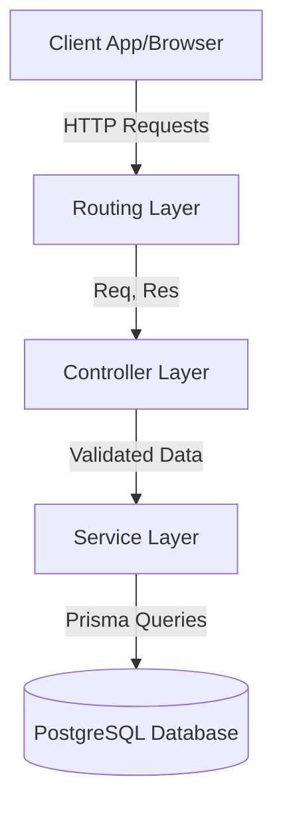
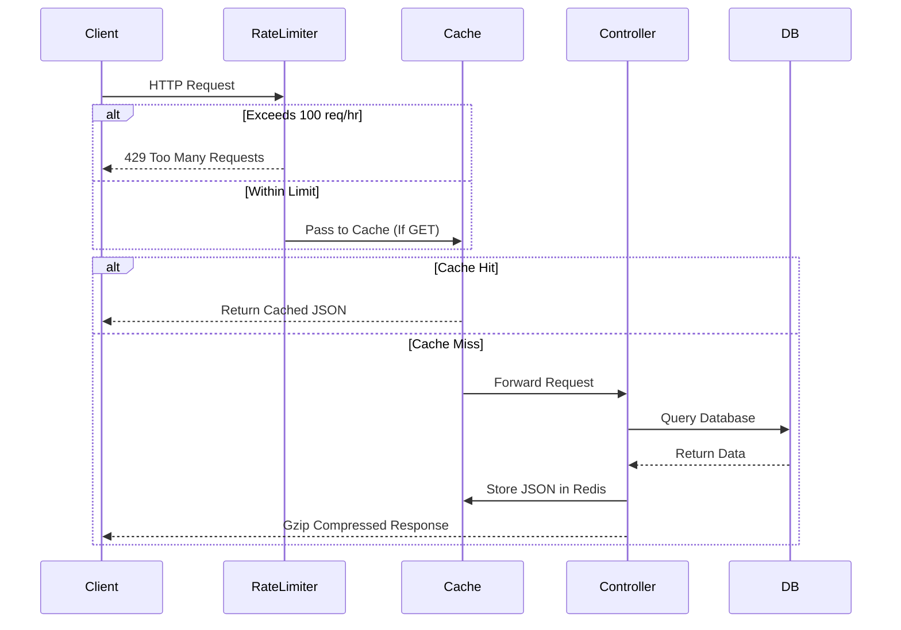
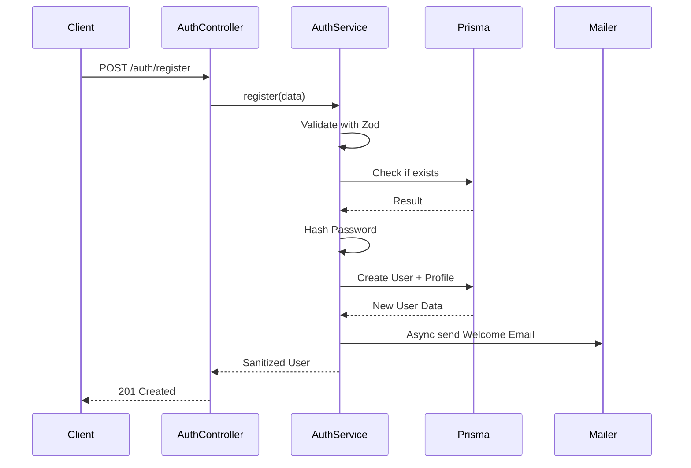
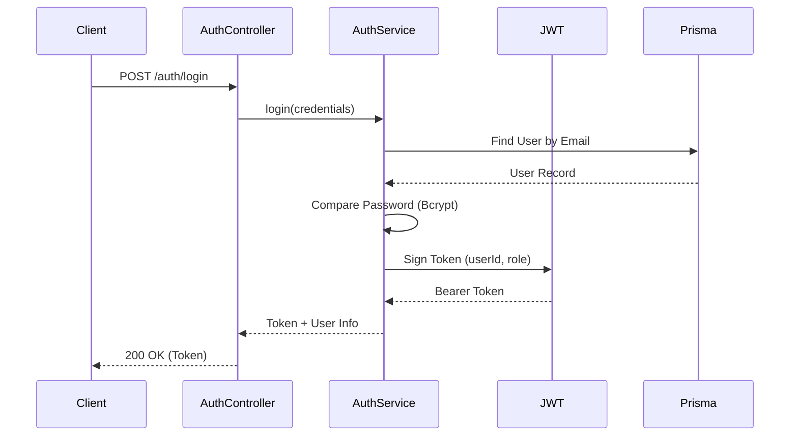
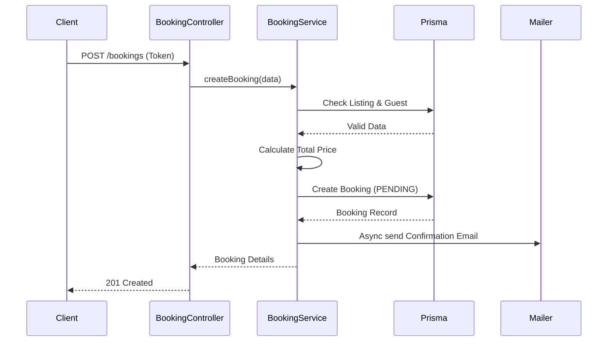

# Airbnb REST API - System Flow & Architecture

This document outlines the complete data flow and system architecture of the Airbnb REST API, detailing how a request moves from the client, through the server layers, interacts with the database/cache, and returns a response, including error handling.

## 1. High-Level Architecture

The API follows a classic **3-Tier Controller-Service-Repository Architecture**:

1. **Routing Layer (`src/routes`)**: Maps HTTP methods and URLs to specific controllers. Also applies route-level middleware (like authentication and role checking).
2. **Controller Layer (`src/controllers`)**: Handles HTTP concerns. Extracts data from `req` (params, body, query), passes it to the Service layer, and sends back the `res` (HTTP status codes and JSON payloads).
3. **Service Layer (`src/services`)**: Contains the core business logic. Validates data using Zod schemas, performs calculations (like booking prices), and interfaces with the database.
4. **Data Access / ORM Layer (`Prisma`)**: Interacts securely with the PostgreSQL database.



## 2. Global Middleware Flow (The Entry Point)

Every incoming request to `/airbnb/api/v1/*` goes through this global pipeline in `src/index.ts`:

1. **Rate Limiting**: Checks if the IP has exceeded 100 requests per hour. If yes, it logs a warning and blocks the request (`429 Too Many Requests`).
2. **JSON Parser**: Parses the incoming request body into a JavaScript object (`req.body`).
3. **Compression**: Compresses outgoing responses using Gzip to save bandwidth.
4. **Caching (GET only)**: If the route has the `cacheResponse` middleware applied (e.g., Listings), it checks Redis. 
   - **Hit**: Returns data instantly from memory.
   - **Miss**: Continues to the controller, and caches the final response before sending it.



## 3. The User Journey (Data Flow)

### Step 3.1: Registration & Profile Creation (`POST /auth/register`)
- **Client**: Sends `{ name, email, password }`.
- **AuthController**: Receives the request and calls `AuthService.register`.
- **AuthService**:
  - Validates input using Zod.
  - Checks Prisma if the email/username exists (Throws `EMAIL_ALREADY_IN_USE` if true).
  - Hashes the password using `bcrypt`.
  - Creates the `User` and simultaneously creates an empty linked `Profile` in Prisma.
  - Sends an asynchronous Welcome Email using `nodemailer`.
- **Response**: Returns `201 Created` with the sanitized user object (password stripped).



### Step 3.2: Login & Authentication (`POST /auth/login`)
- **Client**: Sends `{ email, password }`.
- **AuthService**:
  - Finds the user by email.
  - Compares the hashed password with `bcrypt.compare()`.
  - Generates a **JWT (JSON Web Token)** containing `{ userId, role }` signed with a secret key.
- **Response**: Returns `200 OK` with the `token`.




### Step 3.3: Accessing Protected Routes (e.g., `POST /listings`)
- **Client**: Sends request with header `Authorization: Bearer <token>`.
- **Auth Middleware (`src/middlewares/auth.middleware.ts`)**:
  - Intercepts the request.
  - Verifies the JWT signature.
  - Extracts `userId` and `role` and attaches them to `req.userId` and `req.role`.
  - Checks role requirements (e.g., `requireHost` ensures `req.role === 'HOST'`).
- **ListingController / Service**: Uses `req.userId` to automatically set the `hostId` for the new listing. Creates the listing in PostgreSQL.
- **Response**: Returns `201 Created`.

### Step 3.4: Booking a Property (`POST /bookings`)
- **BookingController**: Receives listing ID and dates.
- **BookingService**:
  - Verifies the listing and guest exist.
  - Calculates the `totalPrice` dynamically `(days * pricePerNight)`.
  - Saves the `PENDING` booking to PostgreSQL.
  - Triggers an async function to send a sleek HTML Confirmation Email to the guest.
- **Response**: Returns the booking details.




### Step 3.5: Logging Out
- Since the API uses stateless JWTs, "logout" is handled entirely on the client-side by deleting the token from local storage or cookies. The server doesn't need to invalidate anything.

## 4. Global Error Handling Flow

When an error occurs anywhere in the app (e.g., validation fails, database crashes, or a custom `throw new Error("NOT_FOUND")` is executed):

1. The Controller catches it via the `try/catch` block and passes it to `next(error)`.
2. The request drops down to the **Global Error Handler** (`src/middlewares/errorHandler.ts`).
3. The Error Handler evaluates the error:
   - **ZodError**: Maps to `400 Bad Request` and formats the field-specific validation messages.
   - **PrismaError**: Maps specific database codes to appropriate HTTP codes (`409 Conflict`).
   - **Custom Domain Errors**: (e.g., `INVALID_CREDENTIALS`) maps to `401 Unauthorized`.
   - **Unknown Errors**: Logs the stack trace securely via Winston and returns `500 Internal Server Error`.
4. **Response**: A standardized JSON error object is sent to the client: `{ status: "error", message: "..." }`.

```mermaid
graph TD
    Error[Error Occurs] --> Controller[Controller Catches]
    Controller --> Next[next(error)]
    Next --> Handler[Global Error Handler]
    Handler --> Zod{Is Zod?}
    Zod -- Yes --> R400[400 Bad Request]
    Zod -- No --> Prisma{Is Prisma?}
    Prisma -- Yes --> R409[409 Conflict / 404]
    Prisma -- No --> Auth{Is Auth Error?}
    Auth -- Yes --> R401[401 Unauthorized]
    Auth -- No --> R500[500 Server Error]
    R400 --> Resp[Standard JSON Response]
    R409 --> Resp
    R401 --> Resp
    R500 --> Resp
```


## 5. Performance Optimizations in the Flow

- **Pagination**: When fetching lists (`GET /users` or `GET /listings`), the controllers parse `?page=1&limit=10`. The services use `Promise.all` to execute the data fetch (`take`/`skip`) and the total count concurrently. The response is shaped beautifully: `{ data, meta: { total, page, limit, totalPages } }`.
- **Indexes**: Prisma translates `@@index` into B-Tree indexes in PostgreSQL, ensuring that finding a user by email or listing by host takes `~1ms` instead of scanning the whole table.
- **Uploads**: Media processing streams directly to Cloudinary (bypassing local disk storage bottlenecks) via Multer memory storage.
